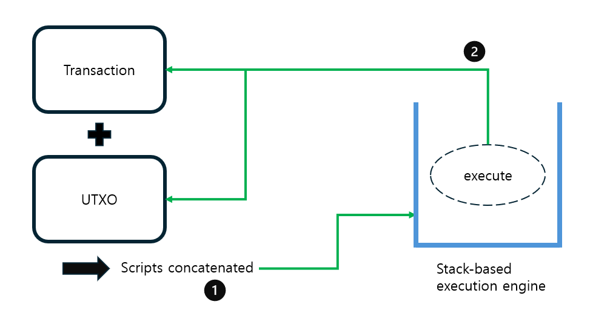

# Stack-based Excution Engine for validating Bitcoin-like scripts

## 目次
1. 使用したモジュール
2. プログラムの流れ
3. 関数の実装説明
4. スナップショットと実行プロセス関数
5. Transactionの検証プロセス

---

## 1. 使用したモジュール
- **hashlib**: SHA256およびRipemd-160のハッシュ関数の実装。
- **cryptography**: 公開鍵、秘密鍵の生成および署名・署名検証機能。
- **json**: JSONファイルの読み込みおよびデータ処理。

## 2. プログラムの流れ
1. `load_utxo()`, `load_transactions()` 関数でJSONファイルからUTXOおよびTransactionを読み込む。
2. 各transactionを`verify_transaction()`で検証。
3. `update_utxo_set()`関数でUTXOセットを更新。

## 3. 関数の実装説明
### 3.1 process_transactions()
- JSONファイルを読み込み、各transactionの有効性を検証。

### 3.2 verify_transaction()
- UTXOセットとの照合およびtransaction内の署名やスクリプトの妥当性を確認。

### 3.3 execute_scripts() と parsing_script()
- PEM形式の公開鍵処理やスタックを利用したスクリプトのパース。
- 各オペコード (DUP, HASH, EQUAL, CHECKSIGなど) をスタックベースで実行し、transactionの妥当性を検証。

## 4. Snapshotと実行プロセス関数
- **snapshot_transactions()**: 処理済みtransactionのSnapshotを表示。
- **snapshot_utxoset()**: 現在のUTXOセットの状態を出力。
- **process_transactions()**: 全プロセスを統合してtransactionを処理し、結果を表示。

## 5. Transactionの検証プロセス
以下の図は、transactionとUTXOを組み合わせ、スタックベースのスクリプト実行エンジンで検証される流れを示しています。

1. transactionとUTXOのスクリプトを連結(concatenate)します。
2. 結合されたスクリプトはスタックベースの実行エンジンで実行され、有効性を確認します。

---

